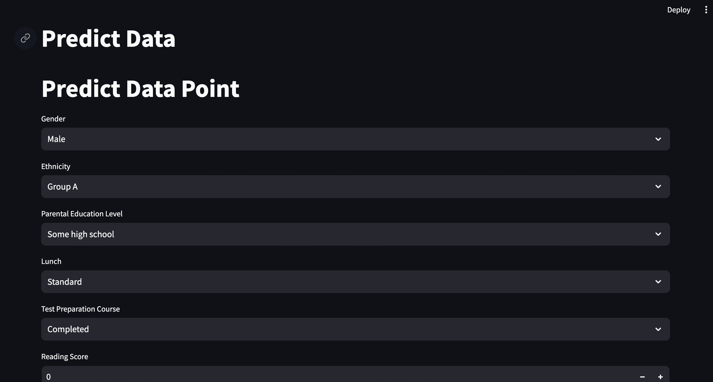

# EduMetrics

Welcome to EduMetrics, a project focused on student performance metrics using Linear Regression, designed with MLOps principles and powered by Streamlit.

---

*Home Page of EduMetrics*

## 📚 Project Overview

EduMetrics is a platform that provides insights into student performance metrics using supervised learning techniques, particularly Linear Regression. By analyzing various factors, it offers accurate predictions and actionable insights to improve educational outcomes.

---

## 🛠️ Technologies Used

- **MLOps**: Implementing Continuous Integration and Continuous Deployment (CI/CD) pipelines for efficient model training and evaluation.
- **Supervised Learning**: Leveraging supervised learning techniques, particularly Linear Regression, for student performance prediction.
- **Streamlit**: Building an interactive and user-friendly web application for displaying performance metrics.

---

## 🚀 Key Features

- **Student Performance Metrics**: Utilizes Linear Regression to analyze factors influencing student performance.
- **MLOps CI/CD Pipeline**: Implements a robust CI/CD pipeline for efficient model training and evaluation.
- **Actionable Insights**: Provides actionable insights to educators and stakeholders for improving educational outcomes.

---

## 💻 Getting Started

To get started with EduMetrics on your local machine, follow these steps:

### Prerequisites

- Python 3.7+
- pip

### Installation

1. Clone the repository
    ```bash
    git clone https://github.com/yourusername/edumetrics.git
    cd edumetrics
    ```
2. Install dependencies
    ```bash
    pip install -r requirements.txt
    ```

### Running the Application

```bash
streamlit run app.py
